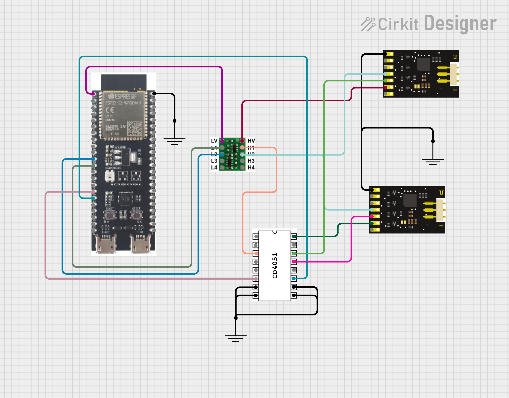

# ❗RPM WRITE NOT WORKING DO NOT USE❗
# ESP32 Castle Creations ESC Controller

This project is for developing an ESP32-S3 library to commmunicate with the Castle ESC to control the motors. It communicates with the ESC using UART and reads various parameters such as voltage, current, throttle, and RPM. It also allows setting the throttle value. The library is located in the `lib` folder and can be copied to other projects. This was developed specifically for the ESP32-S3-DevKitC-1-N32R8V board but can be used with other boards by changing the `platformio.ini` file.

## Features

- Read voltage, current, throttle, and RPM from the ESC
- Set throttle value
- Serial communication for debugging and control


## Getting Started

### Prerequisites

- PlatformIO
- Visual Studio Code
- ESP32-S3 Board (S3-DevKitC-1-N32R8V recommended)

### Hardware Setup
The RX/TX lines need to be connected between the MCU and the Castle Serial Links, but a few intermediate steps are required. Because the serial links use 5V logic, a generic level converter is needed to step it down to 3.3V to avoid damaging the boards. Also since all connected ESCs will try to send a response after each command, a multiplexer is needed to avoid collisions and ensure you are reading from the right device.

The complete schematic is shown below. Click on the image to view an interactive version.

<div style="position: relative; width: 100%; padding-top: calc(max(56.25%, 400px));">
  
  <a href="https://app.cirkitdesigner.com/project/b83b5a70-b015-454e-8b5f-c494706dc60a?view=interactive_preview" style="position: absolute; top: 0; left: 0; width: 100%; height: 100%; border: none;">
    
  </a>

</div>

> [!NOTE]  
> Different GPIO pins can be used for the MUX select as long as you change the corresponding pin definition in the CD4051 header file.

### Installation

1. Clone the repository:
    ```sh
    git clone https://github.com/Super-Sexy-Pump-Team/MotorSerialController.git
    ```
2. Open the project in Visual Studio Code.
3. Install PlatformIO extension for Visual Studio Code.

### Building and Uploading

1. Connect your ESP32-S3 DevKitC-1 to your computer.
2. Open a terminal in Visual Studio Code.
3. Upload the firmware using the platform.io gui or by using:
    ```sh
    pio run --target upload
    ```

### Live Data Monitoring

1. Open the serial monitor.
2. The ESP32-S3 will initialize and start reading data from the ESC and display it to the terminal.
3. You can send throttle values (between 1.0 and 2.0 ms) via the serial monitor to control the ESC by typing the value in the terminal and hitting the enter key.

By default, the program assumes you will be using the platform.io serial monitor built into VS Code. If you are using an external serial monitor that supports ANSI escape codes, you can type `e` in the terminal to enable the use of escape codes for better data logging. Pressing `d` will once again disble the escape codes.


## Library Usage

### Creating an ESC object

In order to use the library you must first create a `castleESC` object. When creating an ESC object you must specify a device ID between 0 and 63. If the specified ID is out of range or a device with the same ID is already active, an error will be thrown. 

Once all objects are created you can initialize them using the `castleESC::ESC_init()` method. Calling the initialization method will start the `Serial2` peripheral, clear the command buffers, and attempt to set all active devices to neutral throttle. Once they are initialized, you can start reading data from the sensors and write to the throttle registers. Here is an example of creating ESC objects and reading sensor data from them:

```cpp
castleESC escObj1(ID1);
castleESC escObj2(ID2);

castleESC::ESC_init();

float V1 = escObj1.readVoltage();
float V2 = escObj2.readVoltage();

Serial.printf("ESC #1 Voltage: %.2fV\n", V1);
Serial.printf("ESC #2 Voltage: %.2fV\n", V2);
```

### Methods of the `castleESC` Class

#### `float readVoltage(void)`

Reads the motor voltage from the Castle ESC.

- **Returns:**
  - `float`: The voltage value (0-20V). Returns -1.0 if an error occurs.

#### `float readThrottle(void)`

Reads the throttle pulse time from the Castle ESC

- **Returns:**
  - `float`: The throttle pulse time (1-2ms). Returns -1.0 if an error occurs.

#### `float readCurrent(void)`

Reads the motor current from the Castle ESC

- **Returns:**
  - `float`: The current value (0-50A). Returns -1.0 if an error occurs.

#### `float readRPM(void)`

Read the motor RPM from the Castle ESC

- **Returns:**
  - `float`: The motor RPM (0-20416). Returns -1.0 if an error occurs.

#### `bool writeThrottle(float throttleMs)`

Set the throttle pulse time of the motor

- **Parameters:**
  - `throttleMs` (float): The throttle pulse time in milliseconds.
- **Returns:**
  - `bool`: Returns `true` on successful write.

## To-Do List
- [ ] Use hardware timer interrupts to update data display
- [ ] Integrate with web gui for remote control and monitoring
